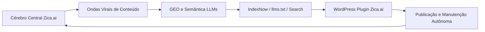

# Zica.ai


**Seu tráfego tá na zica? Deszica com Zica.ai.**

Zica.ai é um SaaS de automação de tráfego orgânico, produção editorial, GEO e otimização semântica para mecanismos de busca e LLMs. Coordena artigos, ondas virais, IndexNow, `llms.txt`, linkagem interna, auditoria técnica e publicação WordPress para Advocacia, Saúde, Imobiliário, Educação e E-commerce.

## Cérebro Central

**Cérebro Central de Tráfego Orgânico e Ondas Virais 24/7**, combinando SEO, GEO e Semântica LLMs para superfícies como ChatGPT, Perplexity e Claude.

## Arquitetura



## Stack

- React 18 + TypeScript + Vite
- Tailwind CSS + shadcn/ui
- Supabase Database, Auth e Edge Functions
- OpenAI, Gemini e Anthropic via BYOK ou configuração de plataforma
- WordPress REST API + plugin oficial Zica.ai
- IndexNow, `llms.txt`, linkagem interna e automações editoriais

## Ambiente

```bash
cp .env.example .env.local
npm install
npm run dev
```

## Variáveis

```bash
VITE_APP_NAME="Zica.ai"
VITE_SUPABASE_URL="https://PROJECT_REF.supabase.co"
VITE_SUPABASE_PUBLISHABLE_KEY="sb_publishable_..."
SUPABASE_URL="https://PROJECT_REF.supabase.co"
SUPABASE_PUBLISHABLE_KEY="sb_publishable_..."
SUPABASE_SECRET_KEY="sb_secret_..."
OPENAI_API_KEY=""
GEMINI_API_KEY=""
ANTHROPIC_API_KEY=""
```

Nunca publique `SUPABASE_SECRET_KEY` ou chaves privadas no frontend.

## Testes

```bash
npm run test
npm run build
npm run lint
```

Testes e build são bloqueantes no CI. O lint permanece como relatório enquanto a dívida técnica herdada é saneada.

## Deploy

O workflow `deploy.yml` gera `zica-ai-web-dist` e utiliza configuração com prefixo `ZICA_AI_`. A publicação externa ocorre somente quando um destino autorizado estiver configurado.

## WordPress

Código canônico: `public/wordpress-plugin/zica-ai/zica-ai-connector.php`.

Namespace REST canônico: `/wp-json/zica-ai/v1/`.

Durante a transição, o namespace legado permanece como alias de compatibilidade para não interromper instalações existentes.

## Segurança

- RLS nas tabelas públicas expostas.
- Segredos somente em backend, Vault ou Edge Function secrets.
- Idempotência em RSS e publicação.
- Sem executor remoto genérico de SQL na superfície operacional.

© 2026 Zica.ai.
